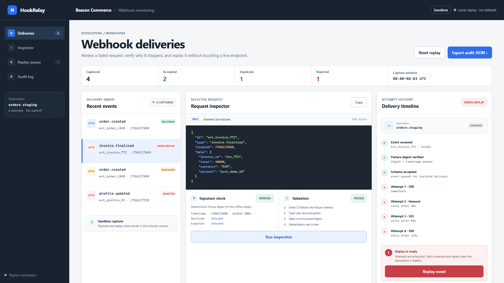

# Webhook recovery workflow — HookRelay

I built HookRelay to make a common integration problem easier to inspect. When an order webhook fails, the useful question is not only “did it fail?” but also why it stopped, whether it was a duplicate and what happened on each retry.

[Open the live demo](https://x3r3s.github.io/hookrelay-webhook-recovery/) · [View CI runs](https://github.com/x3r3S/hookrelay-webhook-recovery/actions)



## What you can try

- inspect four sample order events;
- see validation and duplicate checks in one place;
- follow a retry sequence into recovery or the dead-letter state;
- replay the failed sample locally;
- export the current activity record as JSON.

Everything runs in the browser. The demo never contacts a real webhook endpoint, so it is safe to explore.

## How it is checked

The domain tests cover validation, idempotency, retry timing, dead-letter routing and manual replay. Browser tests cover the working controls, downloads, keyboard navigation and desktop/mobile layouts. The sample input and expected output are kept in [`examples`](./examples/) so the result can be reproduced.

More detail is available in [`docs/implementation-notes.md`](./docs/implementation-notes.md), and the mobile layout is shown in [`screenshots/hookrelay-mobile.png`](./screenshots/hookrelay-mobile.png).

## Run locally

Use Node.js 20 or newer:

```sh
npm ci
npx playwright install chromium
npm start
```

The local address is printed in the terminal.

## Test

```sh
npm test
npm run check
npm run proof:print
```

## About this project

The supplied events and delivery results are synthetic and reproducible. Connecting this workflow to a production webhook service would require provider-specific signature verification, protected secrets, durable queues, storage and monitoring.

The code is available for portfolio review under [`PORTFOLIO-REVIEW-LICENSE.md`](./PORTFOLIO-REVIEW-LICENSE.md).
